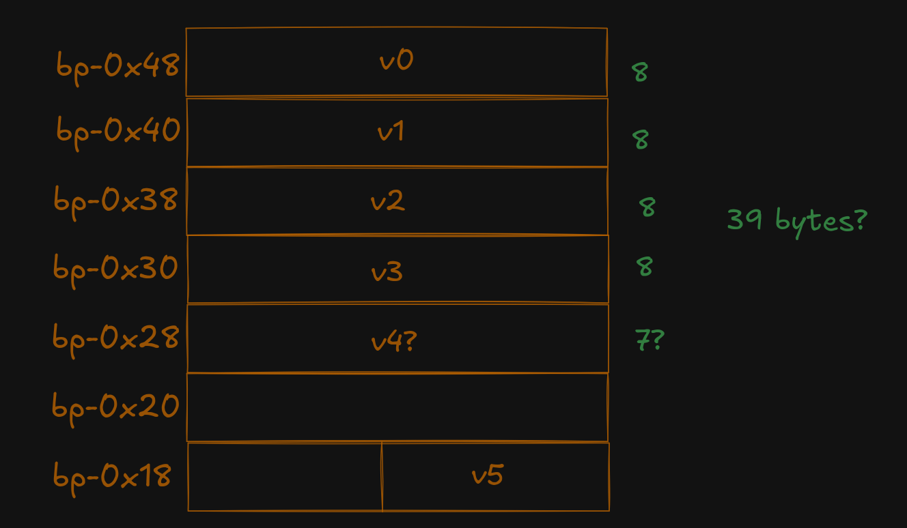

# Rude Guard

_There's a guard that's protecting the flag! How do I sneak past him?_

_By Joel (@jayscx on discord)_

Attachments: `pwnable`

---

just put the binary into dogbolt :P

```c
typedef struct struct_0 {
    char padding_0[8];
    char *field_8;
} struct_0;

unsigned int main(unsigned int flag, struct_0 *a1)
{
    unsigned int v0;  // [bp-0xc]

    if (flag == 1)
    {
        puts("Are you not going to say hello?");
        return 0;
    }
    v0 = atoi(a1->field_8) - 1701604463;
    if (!v0)
    {
        puts("Hi. What do you want.");
        read_input(v0);
        return 0;
    }
    puts("Hi. Go away.");
    return 0;
}

void read_input(unsigned int a0)
{
    char v0;  // [bp-0x28]

    read(a0, &v0, 100);
    if (strcmp(&v0, "givemeflag\n"))
    {
        puts("I won't let you pass. No matter what.");
        return;
    }
    puts("How rude! utflag{you're going to need a sneakier way in...}");
    return;
}

unsigned long long secret_function(void)
{
    char v0[8];  // [bp-0x48]
    unsigned long long v1;  // [bp-0x40]
    unsigned long long v2;  // [bp-0x38]
    unsigned long long v3;  // [bp-0x30]
    unsigned long long v4;  // [bp-0x29]
    unsigned int v5;  // [bp-0x14]
    char v6;  // [bp-0xd]
    unsigned int i;  // [bp-0xc]

    v6 = 50;
    strncpy(&v0, "GFT^SUIU", 8);
    v1 = 4685508798226368071;
    v2 = 7872388188508079469;
    v3 = 5074812880369900102;
    v4 = 5712352499676109382;
    v5 = 39;
    for (i = 0; i < v5; i += 1)
    {
        putchar(v0[i] ^ v6);
    }
    return 0;
}
```

Clearly, `secret_function` will print the flag, except it isn't called. But we can simulate what it will do, because the decompiler has helpfully put the addresses of the memory for the stack variables.

```c
v0 = bp - 0x48
v1 = bp - 0x40
v2 = bp - 0x38
v3 = bp - 0x30
v4 = bp - 0x29 // should be 28?
```

Memory layout:



Suspiciously, v4 is not aligned with the stack boundary and overlaps with v3 (if we trust what the decompiler says). Let's ignore that for now... 

What the code is doing is reading 39 bytes from the stack from `v0`, and printing by XORing with 50. So we can simulate it:

```py
>>> b1 = b'GFT^SUIU'
>>> b2 = (4685508798226368071).to_bytes(8, 'little')
>>> b3 = (7872388188508079469).to_bytes(8, 'little')
>>> b4 = (5074812880369900102).to_bytes(8, 'little')
>>> b5 = (5712352499676109382).to_bytes(8, 'little')
>>> b = b1 + b2 + b3 + b4 + b5
>>> for c in b: print(chr(c ^ 50), end="")
utflag{gu4rd_w4s_w34ker_th4n_i_tth0ught}
```

aaand thats actually not the right flag. removing the extra `t` gives the correct (39-byte!) flag:

```
utflag{gu4rd_w4s_w34ker_th4n_i_th0ught}
```

which presumably indicates what was happening was that the variables `v3` and `v4` were using overlapping memory, (the lower order byte of v4 was the same as the higher order byte of v3).
