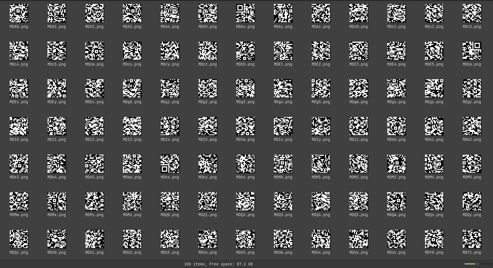
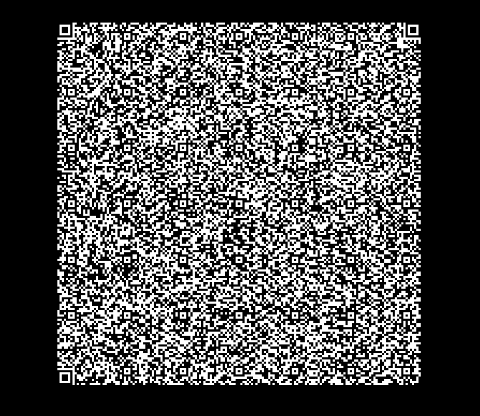

# QRecreate

_I managed to bypass the IPS to exfiltrate the secrets you wanted from the target's intranet. I just hope you remember the encoding structure we agreed on._

_by Emmett (@emdawg25 on discord)_

Attachments: `TaxReports2008.zip`

---

The zip file contains some images:

```
output/MDA0/data/img.png
output/MDA1/data/img.png
...
output/MDkz/data/img.png
output/MTAw/data/img.png
```

I first extracted everything into a directory so I could see what these had:



So we are working with 100 images, which seem to be fragments of a QR code. The corners can be visually identified as: `MDAx`, `MDEw`, `MDkx`.

But there doesn't seem to be any pattern in the file names to determine the order of the images.

This is when [integralOfZero](https://github.com/AnshumaanMishra) happened to oversee what I was doing and suggested me to base64 decode the images :p

The filenames are just numbers 001 to 100 encoded in base64, so after decoding and arranging them in a grid we get (with some gpt-generated python code to do so):



We are done right? Except, for some reason, my phone isn't scanning the code?!?!?

I was later reminded that QR codes need to have a white margin around it so that the scanner can correctly find the finder patterns. So once that was fixed, the qr code contains the following data:

```txt
Lorem ipsum dolor sit amet, consectetur adipiscing elit. Nulla nunc enim, tempor cursus auctor ac, tempor id odio. Proin mattis lacinia maximus. Vestibulum accumsan egestas odio, nec molestie nulla tristique eu. Ut finibus mi et orci tempor, nec venenatis est maximus. Nunc hendrerit sapien et commodo sodales. Quisque libero purus, venenatis in massa in, porta sagittis metus. Donec vitae eros ac nibh vestibulum tristique. Vivamus consequat gravida ex quis volutpat. Nunc ac interdum ligula. Proin consectetur egestas est vitae gravida. Maecenas faucibus aliquet velit, et convallis dui laoreet a. Quisque dapibus eros sed tellus pharetra bibendum. Morbi posuere mollis blandit. Maecenas vel sem purus. Maecenas dictum elementum mattis.

Vestibulum et ultricies tellus. In at efficitur diam. Praesent urna dui, egestas id dui non, ultricies convallis ligula. Mauris dictum imperdiet nunc, eu vulputate sem. Nulla ac ex vel leo rhoncus consequat. Donec sollicitudin suscipit ex, ut vestibulum augue scelerisque ultricies. Maecenas erat eros, ultrices vel hendrerit sollicitudin, mollis in mauris. In eget tristique lacus. Duis mauris mi, rutrum nec elit finibus, vehicula fringilla nunc. Vestibulum iaculis et dui in porttitor. Donec aliquam lectus non neque ultricies, quis imperdiet diam dictum. Lorem ipsum dolor sit amet, consectetur adipiscing elit. Pellentesque a mi dXRmbGFne3MzY3IzdHNfQHJlX0Bsd0B5c193MXRoMW5fczNjcjN0c30= elit viverra interdum. Integer et enim ac justo aliquet fringilla. Phasellus hendrerit metus turpis, at porta sapien posuere id. Ut vitae pharetra velit.

Nulla id justo ut enim feugiat congue. Aliquam congue dui ac nisl luctus, vitae fermentum felis rhoncus. Quisque tempor odio vel commodo molestie. Integer magna erat, sollicitudin a dignissim sagittis, aliquet tempus urna. Morbi rhoncus vitae enim eu ultricies. Nunc in odio nisi. Maecenas eget lacinia ante.

Nullam in velit est. Nulla bibendum sagittis justo eu rhoncus. Phasellus at ante hendrerit, suscipit enim ac, tincidunt neque. Interdum et malesuada fames ac ante ipsum primis in faucibus. Ut faucibus tellus eget consectetur congue. Nam blandit facilisis dui ut ornare. Ut ultricies erat quis eros ultrices mattis.

Aliquam ut eros lacus. Quisque sit amet nunc vehicula, dictum ipsum nec, placerat magna. Vestibulum sollicitudin iaculis metus, et accumsan libero interdum at. Curabitur eu ex in turpis interdum iaculis. Suspendisse et pharetra turpis, a sollicitudin velit. In aliquet id urna scelerisque feugiat. Nulla luctus mi pharetra tincidunt sollicitudin. Aenean non dignissim velit. Ut ut porta arcu, volutpat tincidunt eros. Donec hendrerit euismod porta.
```

Inside this text dump lies the unsuspecting base64 encoded string:

```
dXRmbGFne3MzY3IzdHNfQHJlX0Bsd0B5c193MXRoMW5fczNjcjN0c30=
```
which decodes to give the flag
```
utflag{s3cr3ts_@re_@lw@ys_w1th1n_s3cr3ts}
```